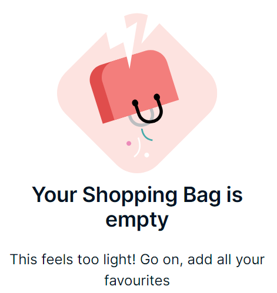

# Nykaa Project

Welcome to the Nykaa project repository!

## Description

This project is a demonstration of [Nykaa](https://www.nykaa.com/), an Indian e-commerce website specializing in beauty and wellness products. The project aims to replicate the user interface and functionality of the Nykaa website.

## Screenshots

## Technologies Used

- HTML5
- CSS3
- JavaScript

## How to Use

1. Clone this repository.
2. Open the `index.html` file in your web browser.

## Contributing

Contributions are welcome! Feel free to submit pull requests or open issues.

## License

This project is licensed under the MIT License - see the [LICENSE](LICENSE) file for details.
